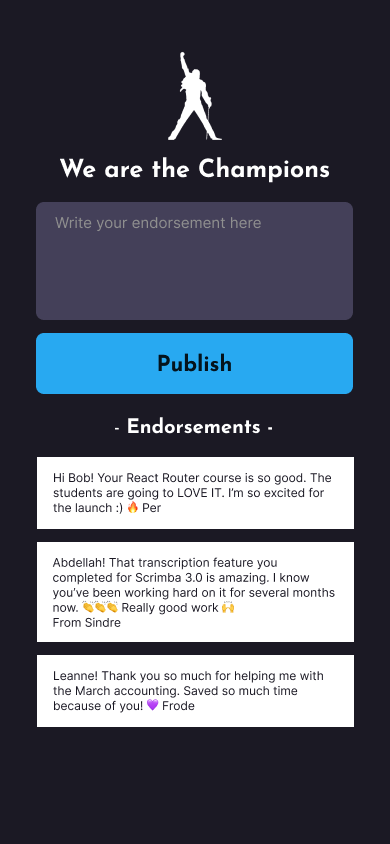
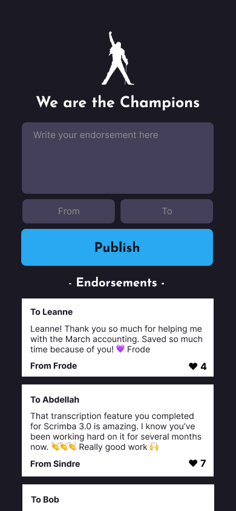

# scrimba-champions
PWA for Scrimba using Firebase

## Core Requirements

### Design

### Requirements
- Use Firebase Realtime Database
- Add endorsement to database when user hits 'Publish' button
- Display endorsements in list
- Update list in realtime

## Stretch Goals

### Design

### Requirements
- 'From' and 'To' input fields that display on the Endorsement list
- Reverse order -- Endorsements should show last first
- "Likes" - that each user can use once
- Desktop version (Responsive)